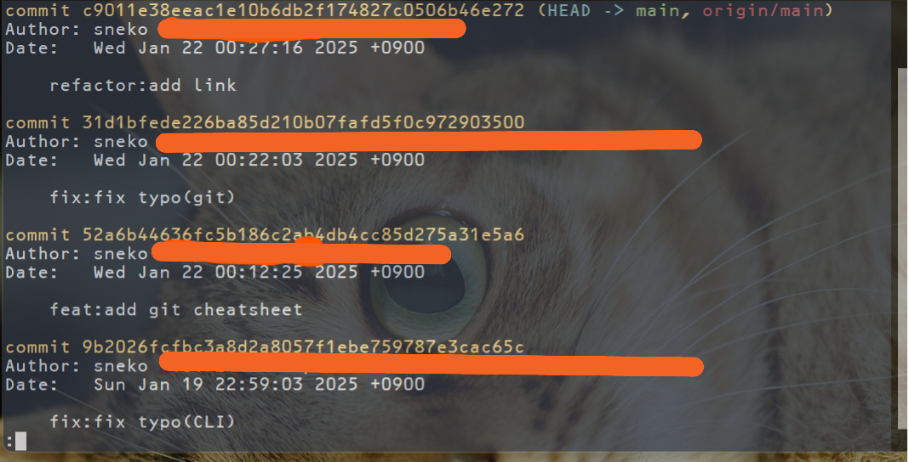

# Git

Gitはソースコードの**バージョン管理システム**です。複数人での開発や、コードの変更履歴を追跡するために使用されます。

## 0. `git config`コマンド

git自体の初期設定用のコマンドです。  
gitを使う前に自分自身の情報を登録します。登録しないと、誰がソースコードを追加したか、修正したか、という履歴が残せませんので、最初にきちんと登録する必要があります。

以下は、ユーザ名とメールアドレスを登録しています。

```sh
git config --global user.name "your_name"
git config --global user.email your_email
```

上手く設定されているかは以下のコマンドで確認できます。

```sh
git config --global -l
```

## 1. `git init`コマンド

現在自分自身がいるディレクトリを **「gitで管理します！」と宣言するコマンド** です。  
このコマンドを入力すると、現在のディレクトリ下に`.git`という名前の隠しディレクトリが作成されます。（このディレクトリを削除すると`git`で管理していた履歴の情報はすべて失われます。逆にいえば、ソースコードを`git`の管理下から外したい場合は、`.git`ディレクトリを削除すればいいわけです）

以下は、`my-project`というディレクトリを作成し、そのディレクトリ下に移動し、`my-project`を git で管理するように宣言している例です。

```sh
mkdir my-project
cd my-project
git init
```

## 2. `git status`コマンド

現在 git で管理している **ファイルやディレクトリの状態（ステータス）を表示するコマンド** です。  
状態というのは、ファイルやディレクトリが、作業ディレクトリにあるのか、それとも、ステージングエリアにあるのか、ということを指します。つまり、新規作成したり、修正を加えたコードが、どこにあるのかを示すコマンドです。

## 3. `git add`コマンド

**変更したファイルとディレクトリをステージングエリアに追加するコマンド** です。  
なお、ステージングエリアを **インデックス** と呼ぶ場合もあります。  
ファイルやディレクトリをステージングエリアに追加する作業を **ステージング** と呼びます。


例として、`scripts`ディレクトリ下の`index.js`ファイルをステージングしたい場合は、以下のようにコマンドを入力します。

```sh
git add scripts/index.js
```

ひとつずつファイルやディレクトリをステージングするのが面倒な場合もあると思います。そのようなケースでは、以下のようにコマンドを打つと、変更があったディレクトリとファイルをすべてステージングできます。

```sh
git add .
```

## 4. `git commit`コマンド

**ステージングエリアに存在するファイルとディレクトリの変更を確定させるコマンド** です。  
ソースコードは、コミットして、はじめて変更履歴に残ります。

コミット時には、必ずメッセージを残す必要があります。どのような修正を加えたかメッセージを残しておかないと、膨大な修正履歴のなかから過去の変更を探す際に苦労するからです。

コミット時にメッセージを残すには、以下のように入力します。

```sh
git commit -m 'メッセージ'
```

## 5. `git log`コマンド

**コミット履歴を表示するコマンド** です。  
誰が、いつ、ソースコードに変更を加えたかを確認できます。



履歴画面は`q`を入力すると、終了できます。

## 6. `git clone`コマンド

**GitHubに存在しているリポジトリ（リモートリポジトリ）をローカルに作成（コピー）するコマンド** です。

```sh
git clone リモートリポジトリのURL
```

たとえば、この`cheatsheet`リポジトリをあなたのローカル環境にクローン（コピー）したい場合、以下のようにします。

**step1.** 「Copy」というボタンを押すと、リモートリポジトリのURLが表示されるのでコピーします。


**step2.** クローンしたいディレクトリ下まで移動し、以下のコマンドを入力します。`git clone`コマンドのあとに、先ほどコピーしたURLをペーストします。

```sh
git clone https://github.com/superneko160/cheatsheet.git
```

しばらく待つと、コマンドを入力したディレクトリに、リポジトリがクローンされているはずです。

## 7. `git pull`コマンド

**リモートリポジトリの最新の変更内容をローカルリポジトリに取り込むコマンド** です。


リモートリポジトリは`GitHub`がもっとも有名ですが、それ以外にも`GitLab`や`BitBucket`などがあります。

チーム開発では、ほかの開発者が行った変更をリモートリポジトリにプッシュすることがあります。その変更を自分のローカルリポジトリに反映させるために`git pull`コマンドを使用します。

```sh
git pull
```

`git pull`は以下の2つのコマンドを組み合わせたものと同じ動作をします。

1. `git fetch` - リモートリポジトリから最新の履歴取得
2. `git merge` - 取得した変更を現在のブランチに統合

また、リモートリポジトリの特定のブランチから変更を取り込みたい場合は、以下のように指定することもできます。

```sh
git pull origin main
```

この場合、`origin`というリモートリポジトリの`main`ブランチから変更を取り込むことを明示的に指定しています。

## 8. `git branch`コマンド

**ブランチの一覧を表示したり、新しいブランチを作成するコマンド** です。

ブランチとは、開発の **作業履歴を分岐させて記録するための機能** です。複数の機能開発やバグ修正を並行して行う際に使用します。
メインの開発ラインである`main`ブランチから新しいブランチを作成し、そのブランチで作業を行います。

### ブランチ一覧を表示

```sh
git branch
```

### 新しいブランチを作成（ブランチの切り替えは行わない）

```sh
git branch ブランチ名
```

### ブランチを削除

```sh
git branch -d ブランチ名
```

## 9. `git switch`コマンド

**作業するブランチを切り替えるコマンド** です。以前は`git checkout`コマンドが使用されていましたが、現在は`git switch`の使用が推奨されています。

### 既存のブランチに切り替え

```sh
git switch ブランチ名
```

### 新しいブランチを作成して切り替え（-cオプション）

```sh
git switch -c 新しいブランチ名
```

例えば、`feature`という名前の新しいブランチを作成して切り替えるには以下のようにします。

```sh
git switch -c feature
```

## 10. `git push`コマンド

**ローカルリポジトリの変更をリモートリポジトリに反映するコマンド** です。  


チーム開発では、自分が行った変更をほかの開発者と共有するために、ローカルリポジトリの内容をリモートリポジトリにプッシュする必要があります。

```sh
git push
```

また、特定のブランチの変更をプッシュしたい場合は、以下のように指定します。

```sh
git push origin ブランチ名
```

例えば、`feature`ブランチの変更を`origin`というリモートリポジトリにプッシュする場合は以下のように指定します。

```sh
git push origin feature
```

初めてリモートリポジトリにプッシュする場合は、以下のように`-u`（`--set-upstream`）オプションを使用します：

```sh
git push -u origin ブランチ名
```

これにより、そのブランチのアップストリーム（追跡対象）が設定され、次回からは単に`git push`とだけ入力すれば良くなります。

## 参考

- [Git - Reference](https://git-scm.com/docs)
