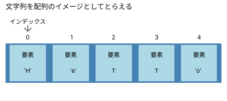
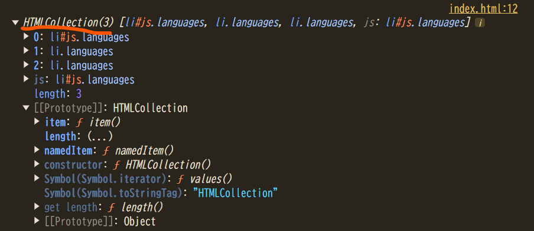
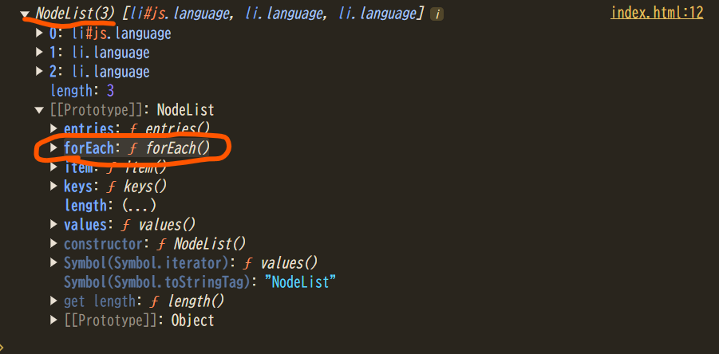

# JSの組み込みオブジェクト

## Index

- [0. JSのオブジェクト](#0-JSのオブジェクト)
- [1. Mathオブジェクト](#1-Mathオブジェクト)
- [2. Dateオブジェクト](#2-Dateオブジェクト)
- [3. Stringオブジェクト](#3-Stringオブジェクト)
- [4. Arrayオブジェクト](#4-Arrayオブジェクト)
- [5. Windowオブジェクト](#5-Windowオブジェクト)
- [6. Documentオブジェクト](#6-Documentオブジェクト)
- [7. Locationオブジェクト](#7-Locationオブジェクト)

## 0. JSのオブジェクト

JSの基本のチートシートのほうで、オブジェクトには値のみを格納していました。

```js
// オブジェクトの定義
const user = {
    firstName: 'Jhon',
    lastName: 'Doe',
    age: 24,
};

// オブジェクトのプロパティを呼び出し
console.log(user.firstName);  // Jhon
```

しかし実は、JSのオブジェクトは、関数を格納することも可能です。

```js
// オブジェクトの定義
const user = {
    firstName: 'Jhon',
    lastName: 'Doe',
    age: 24,
    getName: function() {
        return this.firstName + ' ' + this.lastName;
    }
};

// オブジェクトのプロパティを呼び出し
console.log(user.getName());  // Jhon Doe
```

このように、オブジェクトに格納された関数を**メソッド**と呼びます。

> [!NOTE]
> `this`は「この」「これ」という意味であり、ここでは、「このオブジェクトの」という意味になります。  
> `this.firstName`であれば、`user`オブジェクトの`firstName`という意味になります。  
> `firstName + ' ' + lastName`では正常に動作しません。  
> この場合、`fristName`、`lastName`だけだと、以下のように同じ名前の引数を利用した場合に、引数の変数なのか、オブジェクト自体が持っている変数なのか区別ができなくなるからです。
> ```js
> getName: function(firstName, lastName) {
>     // userオブジェクトのプロパティのfirstNameではなく、引数のfirsNameを利用する書き方として機能する
>     return firstName + ' ' + lastName;
> }
> ```

ところで、この形、どこかで見たことがないでしょうか？

```js
user.getName()
```

たとえば、みなさんが何度か書いているであろう

```js
console.log()
```

だったり、

```js
Math.floor(2.45)
```

です。

`if`文や`for`文などの制御構文と呼ばれる基礎的な命令を除くと、今まで利用してきた命令はほとんど、`オブジェクト名.プロパティ名`、`オブジェクト名.メソッド名()`という形式に沿っていたのです。（`console.log()`であれば、`console`オブジェクトの`log()`メソッドを利用する、という命令をつかっていました）

しかし、みなさんは`console`オブジェクトや`Math`オブジェクトを作成した覚えはないはずです。

このように、JSが最初から用意してくれているオブジェクトを **組み込みオブジェクト（ビルトインオブジェクト）** と呼びます。JS側に最初から組み込まれているから組み込みオブジェクトです。

組み込みオブジェクトは数多く存在するので、すべて覚えるのは不可能です。使いたい命令は[公式リファレンス](https://developer.mozilla.org/ja/docs/Web/JavaScript/Reference/Global_Objects)を確認しにいくなどして利用します。しかし、ある程度は知っておいたほうが開発効率がいいのも事実です。ここではよく利用するものだけを紹介します。

> [!CAUTION]
> 上ではJSのすべての組み込みオブジェクトがオブジェクトで作成されているような紹介をしてしまいましたが、正確には少々違います。JSの組み込みオブジェクトは、その種類によって実装方法が異なります。
> 
> たとえば、`Array`、`String`、`Number`、`Date`などは実際にはコンストラクタ関数／クラスと呼ばれるもので実装されています。
> 
> ほかのオブジェクトも、もともとはオブジェクトで作成されていたものも、ECMAScript2015（ES6）以降に導入されたclass構文を採用して書き直されていっています。

## 1. Mathオブジェクト

`Math`オブジェクトは数学演算の機能を提供するオブジェクトです。

### [random()](https://developer.mozilla.org/ja/docs/Web/JavaScript/Reference/Global_Objects/Math/random)

`0`以上`1`未満の範囲で浮動小数点の乱数を返すメソッド。乱数というのは、ランダムな数という意味です。

```js
console.log(Math.random());  // 0.6144782009746015 など
```

`0`以上`1`未満という特定の範囲で使うケースは少ない。そこで、`* n`する。そうすると、`0`以上`n`未満の数値が得られるようになります。

```js
// 0以上10未満の乱数を取得
console.log(Math.random() * 10);  // 3.0545764999145786 など
```

端数が不要であれば、後述する`Math.ceil()`、`Math.floor()`、`Math.trunc()`、`Math.round()`を利用します。

```js
// 0以上10未満の乱数を、小数点を切り捨てて取得
console.log(Math.floor(Math.random() * 10));  // 7 など
```

### [ceil()](https://developer.mozilla.org/ja/docs/Web/JavaScript/Reference/Global_Objects/Math/ceil)

小数点以下を切り上げて整数を返すメソッド。

```js
console.log(Math.ceil(5.1));   // 6
console.log(Math.ceil(5.9));   // 6
console.log(Math.ceil(-5.1));  // -5
console.log(Math.ceil(-5.9));  // -5
```

### [floor()](https://developer.mozilla.org/ja/docs/Web/JavaScript/Reference/Global_Objects/Math/floor)

小数点以下を切り捨てて整数を返すメソッド。

```js
console.log(Math.floor(5.1));   // 5
console.log(Math.floor(5.9));   // 5
console.log(Math.floor(-5.1));  // -6
console.log(Math.floor(-5.9));  // -6
```

### [trunc()](https://developer.mozilla.org/ja/docs/Web/JavaScript/Reference/Global_Objects/Math/trunc)

小数点以下を切り落として整数を返すメソッド。負の数の場合は`Math.ceil()`、正の数の場合は`Math.floor()`と同じ結果になります。

```js
console.log(Math.trunc(5.1));   // 5
console.log(Math.trunc(5.9));   // 5
console.log(Math.trunc(-5.1));  // -5
console.log(Math.trunc(-5.9));  // -5
```

### [round()](https://developer.mozilla.org/ja/docs/Web/JavaScript/Reference/Global_Objects/Math/round)

小数点以下を四捨五入して整数を返すメソッド。

```js
console.log(Math.round(5.1));   // 5
console.log(Math.round(5.9));   // 6
console.log(Math.round(-5.1));  // -5
console.log(Math.round(-5.9));  // -6
```

## 2. Dateオブジェクト

`Date`オブジェクトは日付と時刻を扱うためのオブジェクトです。  
`Date`オブジェクトは`Math`オブジェクト等と異なり、**`new`を使ってオブジェクトを生成する必要があります。**

```js
const now = new Date();  // 現在の日時のDateオブジェクトを生成
console.log(now);  // Tue Dec 31 2024 10:23:41 GMT+0900 など
```

```js
const date = new Date('2024-11-24');  // 特定の日時を指定してDateオブジェクトを生成
console.log(date);  // Sun Nov 24 2024 09:00:00 GMT+0900
```

### [getFullYear()](https://developer.mozilla.org/ja/docs/Web/JavaScript/Reference/Global_Objects/Date/getFullYear)

年を4桁の数値で取得します。

```js
const date = new Date('2024-12-31');
console.log(date.getFullYear());  // 2024
```

> [!CAUTION]
> 同じようなメソッドで[getYear()](https://developer.mozilla.org/ja/docs/Web/JavaScript/Reference/Global_Objects/Date/getYear)メソッドがありますが、こちらは現在、非推奨になっています。

### [getMonth()](https://developer.mozilla.org/ja/docs/Web/JavaScript/Reference/Global_Objects/Date/getMonth)

月を0から11の数値で取得します（0が1月、11が12月）。**そのため`+1`して実際の月にするのを忘れないようにしましょう。**

```js
const date = new Date('2024-12-25');
console.log(date.getMonth());      // 11
console.log(date.getMonth() + 1);  // 12 実際の月を取得
```

### [getDate()](https://developer.mozilla.org/ja/docs/Web/JavaScript/Reference/Global_Objects/Date/getDate)

日を1から31の数値で取得します。

```js
const date = new Date('2024-12-31');
console.log(date.getDate());  // 31
```

### [getDay()](https://developer.mozilla.org/ja/docs/Web/JavaScript/Reference/Global_Objects/Date/getDay)

曜日を0から6の数値で取得します（0が日曜日、6が土曜日）。このような仕様になっているのは、各国で曜日の言葉が異なるためです。あえて数値で取得する仕様にしてくことで、柔軟性を持たせているのです。  
では、数値からどのようにして実際の曜日を表示するのかというと、以下の書くケースが多いです。

```js
const date = new Date('2024-12-31');
console.log(date.getDay());  // 2 （火曜日）

// 曜日を日本語で表示する場合
const jp_weekdays = ['日', '月', '火', '水', '木', '金', '土'];
console.log(jp_weekdays[date.getDay()]);  // 火

// 曜日を英語で表示する場合
const en_weekdays = ['Sun', 'Mon', 'Tue', 'Wed', 'Thu', 'Fri', 'Sat'];
console.log(en_weekdays[date.getDay()]);  // Tue
```

### [getHours()](https://developer.mozilla.org/ja/docs/Web/JavaScript/Reference/Global_Objects/Date/getHours)

時を0から23の間の整数で取得します。

```js
const now = new Date();
console.log(now.getHours());  // 11 など
```

### [getMinutes()](https://developer.mozilla.org/ja/docs/Web/JavaScript/Reference/Global_Objects/Date/getMinutes)

分を0から59までの整数で取得します。

```js
const now = new Date();
console.log(now.getMinutes());  // 52 など
```

## 3. Stringオブジェクト

`String`オブジェクトは文字列を操作するための機能を提供するオブジェクトです。  
ここでいう`String`というのは、つまり、文字列です。今まで扱ってきた文字列も実はオブジェクトなのです。

### [length](https://developer.mozilla.org/ja/docs/Web/JavaScript/Reference/Global_Objects/String/length)

`length`プロパティは、文字列の長さ（文字数）を取得します。

```js
const str = 'Hello';
console.log(str.length);  // 5
```

`String`オブジェクトは文字列自体を指しているので、変数に代入せずとも、`文字列.プロパティ`、`文字列.メソッド()`のように文字列から直接プロパティやメソッドを利用することも可能です。

```js
console.log('Hello'.length);  // 5
```

### [slice()](https://developer.mozilla.org/ja/docs/Web/JavaScript/Reference/Global_Objects/String/slice)

文字列の一部を切り出すメソッド。引数に開始位置と終了位置を指定します。

開始位置と終了位置の指定の仕方は、**文字列を配列のイメージとしてとらえるとよい**です。以下の画像のように、配列の1つの要素に1つの文字が入っているイメージです。

どこの位置から（開始位置）どこの位置まで（終了位置）を指定する方法は、**配列のインデックスを指定する方法と同じ**だと考えれば理解しやすいでしょう。そして、このイメージは、下記の`indexOf`やほかのメソッドでも有効な考え方です。



```js
const str = 'Hello World';

// 0番目のインデックスの文字から5番目のインデックスの文字を切り出す
console.log(str.slice(0, 5));  // Hello

// 2番目のインデックスの文字から8番目のインデックスの文字を切り出す
console.log(str.slice(2, 8));  // llo Wo
```

> [!NOTE]
> サンプルコードでも確認できるとおり、空白文字も1文字としてカウントします。

### [indexOf()](https://developer.mozilla.org/ja/docs/Web/JavaScript/Reference/Global_Objects/String/indexOf)

指定した文字列が最初に現れる位置を返すメソッド。見つからない場合は`-1`を返します。

```js
const str = 'Hello World';
console.log(str.indexOf('World'));   // 6
console.log(str.indexOf('world'));   // -1  大文字小文字は区別される
console.log(str.indexOf('o'));       // 4   最初に見つかった位置
```

### [replace()](https://developer.mozilla.org/ja/docs/Web/JavaScript/Reference/Global_Objects/String/replace)

文字列の一部を置換するメソッド。最初に見つかった部分のみ置換します。

```js
const str = 'Hello World';
console.log(str.replace('World', 'JavaScript'));  // 'Hello JavaScript'
console.log(str.replace('o', 'O'));              // 'HellO World'  最初の'o'のみ置換
```

### [replaceAll()](https://developer.mozilla.org/ja/docs/Web/JavaScript/Reference/Global_Objects/String/replaceAll)

文字列の一部を全て置換するメソッド。

```js
const str = 'Hello World, Hello JavaScript';
console.log(str.replaceAll('Hello', 'Hi'));  // 'Hi World, Hi JavaScript'
```

### [split()](https://developer.mozilla.org/ja/docs/Web/JavaScript/Reference/Global_Objects/String/split)

文字列を指定した区切り文字で分割し、配列にして返すメソッド。  
引数に空文字を指定すると1文字ずつ区切ります。

```js
const str = 'apple,banana,orange';
console.log(str.split(','));          // ['apple', 'banana', 'orange']
console.log('Hello'.split(''));       // ['H', 'e', 'l', 'l', 'o']
```

## 4. Arrayオブジェクト

`Array`オブジェクトは配列を操作するための機能を提供するオブジェクトです。  
ここでいう`Array`というのは、つまり、配列です。JSでは配列もオブジェクトの一種なのです。

`length`プロパティと`push()`、 `pop()`、 `unshift()`、 `shift()`、`forEach()`メソッドに関しては、基本編のチートシートで既出ですが、再度掲載しています。

### [length](https://developer.mozilla.org/ja/docs/Web/JavaScript/Reference/Global_Objects/Array/length)

配列の要素数を返します。

```js
const items = ['pen', 'notebook', 'eraser'];
console.log(items.length);  // 3
```

### [push()](https://developer.mozilla.org/ja/docs/Web/JavaScript/Reference/Global_Objects/Array/push)

配列の末尾に要素を追加するメソッド。

```js
const fruits = ['apple', 'banana'];
fruits.push('orange');
console.log(fruits);  // ['apple', 'banana', 'orange']
```

### [pop()](https://developer.mozilla.org/ja/docs/Web/JavaScript/Reference/Global_Objects/Array/pop)

配列の末尾の要素を削除して、その要素を返すメソッド。

```js
const fruits = ['apple', 'banana', 'orange'];
const lastFruit = fruits.pop();
console.log(lastFruit);  // 'orange'
console.log(fruits);     // ['apple', 'banana']
```

### [unshift()](https://developer.mozilla.org/ja/docs/Web/JavaScript/Reference/Global_Objects/Array/unshift)

配列の先頭に要素を追加するメソッド。

```js
const fruits = ['apple', 'banana'];
fruits.unshift('orange');
console.log(fruits);  // ['orange', 'apple', 'banana']
```

### [shift()](https://developer.mozilla.org/ja/docs/Web/JavaScript/Reference/Global_Objects/Array/shift)

配列の先頭の要素を削除して、その要素を返すメソッド。

```js
const fruits = ['apple', 'banana', 'orange'];
const firstFruit = fruits.shift();
console.log(firstFruit);  // 'apple'
console.log(fruits);      // ['banana', 'orange']
```

### [forEach()](https://developer.mozilla.org/ja/docs/Web/JavaScript/Reference/Global_Objects/Array/forEach)

配列の各要素に対して関数を実行するメソッド。forEach()メソッドの引数には文字列や数値、配列といった値ではなく関数を指定します。

```js
const fruits = ['apple', 'banana', 'orange'];

fruits.forEach(function(fruit, index) {
    console.log(`${index}: ${fruit}`);
});

// 0: apple
// 1: banana
// 2: orange
```

> [!NOTE]
> 名前をつけた関数を自作して引数に設定してもよいが、ここでの関数は`foreEach()`の処理でのみ使うことが多く、ほかの箇所で利用するケースが少ないので、名前を付与した関数を利用する意味が薄い。
> そこで、名前を持たない関数を直接引数に設定する。このように名前のない関数を**無名関数**と呼ぶ。
> また、このように関数内やメソッドの引数に設定する関数を**コールバック関数**と呼ぶ。

なお、無名関数の第2引数`index`は使う予定がなければ書かなくてもかまいません。

```js
const fruits = ['apple', 'banana', 'orange'];

fruits.forEach(function(fruit) {
    console.log(`${fruit}`);
});

// apple
// banana
// orange
```

また

```js
const fruits = ['apple', 'banana', 'orange'];

fruits.forEach((fruit, index) => {
    console.log(`${index}: ${fruit}`);
});

// 0: apple
// 1: banana
// 2: orange
```

のように**アロー関数**を利用するケースもよく見られます。

### [join()](https://developer.mozilla.org/ja/docs/Web/JavaScript/Reference/Global_Objects/Array/join)

配列の全要素を順に連結した新しい文字列を返します。区切り文字はカンマ、または引数に指定された文字列です。

```js
const elements = ['Fire', 'Air', 'Water'];

console.log(elements.join());  // Fire,Air,Water  引数になにも指定しない

console.log(elements.join(''));  // FireAirWater  引数に空文字を指定

console.log(elements.join(' and '));  // Fire and Air and Water  引数に and を指定
```

## 5. Windowオブジェクト

JSはブラウザ側で動く唯一無二の特徴を持ったプログラミング言語です。そのため、ブラウザを操作するためのオブジェクトを持っています。それらを総称してブラウザオブジェクトと呼ぶのですが、その最上位の階層に存在するのが`Window`オブジェクトです。


ブラウザオブジェクトのすべては、この最上位に位置する`Window`オブジェクトを通してアクセスします。

たとえば、`document.getElementById()`を使って、特定のHTMLを取得したことがあるかと思います。実は、それは以下のようにも書けます。

```js
const title = window.document.getElementById('title');
```

しかし、実際には、このように書くのは非常に面倒なので、`window`の部分は省略して書けるようになっているのです。

```js
const title = document.getElementById('title');
```

`window`オブジェクト直下のメソッドも例外ではなく、以下に紹介する`alert()`メソッド等も、`window.alert()`ではなく`alert()`のように`window`を省略して記述できます。

### [alert()](https://developer.mozilla.org/ja/docs/Web/API/Window/alert)

指定された警告メッセージとして表示します。

```js
window.alert('氏名が入力されていません');
```

### [confirm()](https://developer.mozilla.org/ja/docs/Web/API/Window/confirm)

確認ダイアログを表示します。`alert()`が警告メッセージを表示するのみなのに対し、`confirm()`はユーザになにからしらの意思表示を求めることができます。確認ダイアログでは、OKボタンを押すと`true`、キャンセルボタンが押されると`false`を返します。

```js
const check = window.confirm('メッセージを送信してもよろしいですか？');
console.log(check);  // OKボタン押下時true、キャンセルボタン押下時false
```

### [prompt()](https://developer.mozilla.org/ja/docs/Web/API/Window/prompt)

入力ダイアログを表示します。入力された文字をメソッドの返り値として受け取ることができます。

```js
const input = window.prompt('名前を入力してください');

console.log('あなたの名前は:' + input + 'です');
```

### [setTimeout()](https://developer.mozilla.org/ja/docs/Web/API/Window/setTimeout)

一定時間が経過したあとに、コールバック関数内に記述された処理を実行します。

第1引数にコールバック関数、第2引数に時間を指定します。

```js
window.setTimeout(コールバック関数, 時間);
```

```js
// 5秒後にHelloという文字の入った警告アラートを表示
window.setTimeout(function() {
    alert('Hello!!');
}, 5000);
```

### [setInterval()](https://developer.mozilla.org/ja/docs/Web/API/Window/setInterval)

一定時間ごとに、コールバック関数内に記述された処理を実行します。

第1引数にコールバック関数、第2引数に時間を指定します。

```js
window.setInterval(コールバック関数, 時間);
```

```js
// 5秒ごとにHelloという文字をコンソールに表示
window.setInterval(function() {
    console.log('Hello');
}, 5000);
```

## 6. Documentオブジェクト

### [getElementById()](https://developer.mozilla.org/ja/docs/Web/API/Document/getElementById)

引数に指定された`id`を持つHTML要素を取得します。

```js
<html>
<head>
</head>
<body>
  <ul>
    <li class="languages" id="js">JavaScript</li>
    <li class="languages">PHP</li>
    <li class="languages">Python</li>
  </ul>
  <script>
    const element = document.getElementById('js');
    console.log(element);  // <li class="languages" id="js">JavaScript</li>
  </script>
</body>
</html>
```

### [getElementsByClassName()](https://developer.mozilla.org/ja/docs/Web/API/Document/getElementsByClassName)

引数に指定された`class`を持つすべての子要素の配列ライクなオブジェクト（`HTMLCollection`）を取得します。

```js
<html>
<head>
</head>
<body>
  <ul>
    <li class="languages" id="js">JavaScript</li>
    <li class="languages">PHP</li>
    <li class="languages">Python</li>
  </ul>
  <script>
    const elements = document.getElementsByClassName('languages');

    for (const element of elements) {
        console.log(element);
    }
  </script>
</body>
</html>
```

### [querySelector()](https://developer.mozilla.org/ja/docs/Web/API/Document/querySelector)

引数に指定されたセレクタに一致するHTML要素を取得します。  
`getElementById()`や`getElementsByClassName()`と異なり、セレクタで指定するので`id`であれば`#`、`class`であれば`.`を書くのを忘れないようにしましょう。

```js
<html>
<head>
</head>
<body>
  <ul>
    <li class="language" id="js">JavaScript</li>
    <li class="language">PHP</li>
    <li class="language">Python</li>
  </ul>
  <script>
    const element = document.querySelector('ul #js');
    console.log(element);  // <li class="language" id="js">JavaScript</li>
  </script>
</body>
</html>
```

### [querySelectorAll()](https://developer.mozilla.org/ja/docs/Web/API/Document/querySelectorAll)

引数に指定されたセレクタに一致するHTML要素のリスト（`NodeList`）を取得します。

```js
<html>
<head>
</head>
<body>
  <ul>
    <li class="language" id="js">JavaScript</li>
    <li class="language">PHP</li>
    <li class="language">Python</li>
  </ul>
  <script>
    const elements = document.querySelectorAll('ul .language');

    elements.forEach(function(element) {
        console.log(element);
    });
  </script>
</body>
</html>
```

> [!NOTE]
> 
> ところで、`getElementsByClassName()`と`querySelectorAll()`で取得したHTML要素をループさせる際、`getElementsByClassName()`のコード例では`for...of`を利用し、`querySelectorAll()`のコード例では`forEach()`を利用している点に気づいたでしょうか。これには理由があります。
> 
> 取得したHTML要素を`console.log()`で確認するとわかるのですが、`getElementsByClassName()`で取得したほうは`HTMLCollection`というオブジェクトで、`querySelectorAll()`で取得したほうは`NodeList`というオブジェクトになっています。両方とも単純な配列やオブジェクトではないのです。
> 
> 
> 
> 
> コンソールに表示された`[[Prototype]]:`を展開すると、そのオブジェクトが使えるメソッド一覧を見ることができます。
> `HTMLCollection`のほうには`foreEach()`メソッドの記載はなく、`NodeList`のほうには`foreEach`メソッドの記載があるのが確認できます。
> 
>このように、オブジェクトは使えるプロパティ、メソッドがあらかじめ決まっています。`Math`オブジェクトが`Math.alert()`のように`alert()`メソッドが使えないことを考えてもらえればすんなり頭に入ってきやすいはずです。
>
> `getElementsByClassName()`のサンプルコードで`for...of`を使っていた理由は、シンプルに`forEach()`メソッドが使えなかったからです。利用しようとすると、`Uncaught TypeError: Cannot read properties of undefined (reading 'forEach')`というエラーが出ます。エラー文を直訳すると **「forEachは未定義のプロパティだから読み込めません」** と言っています。未定義というのは、存在しないということです。つまり、そのままの意味でエラーが出るのが確認できます。

## 7. Locationオブジェクト

Webページのアドレス情報を取得、操作するオブジェクトです。

### [href](https://developer.mozilla.org/ja/docs/Web/API/Location/href)

`location`オブジェクトを利用する最も典型的な用途は、JSからページ移動を制御することです。

```js
const check = window.confirm('メッセージを送信してもよろしいですか？');

// OKボタン押下時、メッセージ送信完了ページに遷移
if (check) {
    location.href = 'https://example.com/complete/'
}
```
