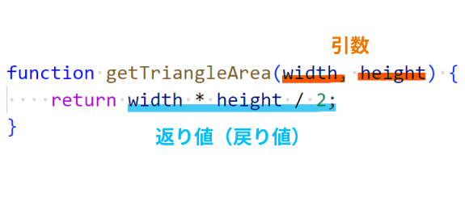
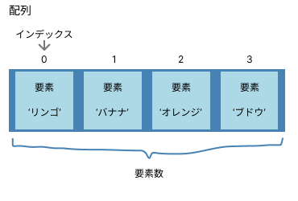
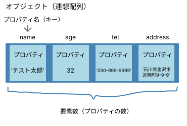
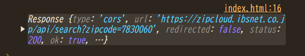
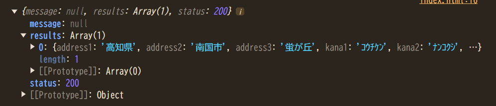

# JavaScriptチートシート

## Index

- [0. プログラミングとは](#0-プログラミングとは)
- [1. JavaScriptとは](#1-JavaScriptとは)
- [2. 変数](#2-変数)
- [3. データ型](#3-データ型)
- [4. 演算子](#4-演算子)
- [5. 条件分岐](#5-条件分岐)
- [6. ループ処理](#6-ループ処理)
- [7. 関数](#7-関数)
- [8. 配列](#8-配列)
- [9. オブジェクト](#9-オブジェクト)
- [10. イベント処理](#10-イベント処理)
- [11. 非同期処理](#11-非同期処理)
- [12. 参考](#12-参考)

## 0. プログラミングとは

コンピュータに実行させたい処理を記述した文書をプログラムと呼びます。  
つまり、プログラマとは、コンピュータに対するマニュアルをつくる人たちです。  
このマニュアルはコンピュータが理解できる言語で書かないといけません。  
英語圏の人には英語で、中国の人には中国語で指示を出さないといけないように、です。  
このコンピュータが理解できる言語というのが、プログラミング言語です。  

## 1. JavaScriptとは

### 概要

プログラミング言語のひとつです。`JS`と略されます。ほかのプログラミング言語の**Javaとはまったくの別物なのでJavaScriptのことを絶対にJavaと略してはいけません。**

ファイルの拡張子は`.js`とします。

JSは数あるプログラミング言語のなかで、**ブラウザ上で動く**という唯一無二の特徴を持ちます。

### HTMLファイルでの実行

HTML上でJSを実行する方法は以下のように、主に2つあります。

```html
<!DOCTYPE html>
<html>
<head>
    <title>JavaScriptの例</title>
</head>
<body>
    <!-- 1. 直接スクリプトを書く方法 -->
    <script>
        console.log('Hello, World!');
    </script>

    <!-- 2. 外部ファイルを読み込む方法 -->
    <script src='script.js'></script>
</body>
</html>
```

### 開発者ツールでの確認方法

1. ブラウザで`F12`キーを押す
2. `Console`タブを選択

JavaScriptはコンソール画面で**エラー**が出ていないか確認できます。

エラーはPCやプログラムが壊れた！というものではありません。コンピュータが親切に **ここが間違っているのではないですか？** と教えてくれているものになります。なので、無視せずきちんと読みましょう。最初は意味がわからないかもしれませんが、慣れてくるとプログラム作成の際の非常に心強い味方になります。エラーを無視すると、画面上に答えが出ているのにも関わらず、意味のない時間を浪費してしまいます。

### デバッグ方法

値を確認する最も基本的な方法として`console.log()`という命令があります。

```js
console.log('Hello, JavaScript!!');  // コンソール上にHello, JavaScript!!と表示する
```

### 注意点

- セミコロン（`;`）を文の末尾に付与することが推奨される
- **予約語**(`if`、`for`など)は変数名として使用できない

## 2. 変数

**変数**とはデータを入れるための箱です。この箱には自由に名前をつけられます。  
下の例では`data`と名のついた箱を用意しています。  
その箱のなかに`hello`という文字を入れています。  
箱の中に数値や文字を入れることを**代入**と呼びます。数値や文字は**値**と呼ばれます。


```js
// dataという名前の箱にHelloという文字を入れる
const data = 'Hello';
```

文字の場合、プログラムの命令ではなく、ただの文字だとコンピュータに教えるためにシングルクォーテーションかダブルクォーテーションで囲みます。

数値の代入も可能です。数値の場合はシングルクオーテーションやダブルクォーテーションで囲みません。

```js
// numという名前の箱に24という数値を入れる
const num = 24;
```

計算の代入も可能です。

```js
const result = 13 + 2;
console.log(result);  // 15
```

### constとlet

変数の箱を**用意する**という意味を持つ命令が`const`と`let`です。
（`const`と`let`は用意するという意味なので、それ以降は変数を利用する場合、`const`と`let`は不要です）

下の2つのコードはどちらも同じ意味です。
```js
const text = 'Hello';
```

```js
let text = 'Hello';
```

2つの違いは値を上書きできるか否かです。値を上書きすることを**再代入**と呼びます。

```js
const text = 'Hello';

// textという箱にGoodByeという文字を再代入
text = 'GoodBye';  // エラーになる
```

```js
let text = 'Hello';

// textという箱にGoodByeという文字を再代入
text = 'GoodBye';  // エラーにならない
```

### 変数のベストプラクティス

1. 基本的には`let`ではなく`const`を利用する
2. 変数には意味のある名前をつける

```js
// NG
let a = 'Star Wars';

// OK
const title = 'Star Wars';
```

## 3. データ型

データ型とは**変数に入れる値の種類**です。単に**型**とも呼ばれます。

型にはいろいろ種類がありますが、ここでは基本の3つを紹介します。
なお、型がなにか調べるには`typeof()`が使えます。

### 1. 文字列型（string型）

ダブルクォートかシングルクォートで囲むと文字列になります。
数値でもシングルクォートかダブルクォーテーションで囲むと文字列として認識されます。

```js
// 1. 文字列型（string型）：ダブルorシングルクォートで囲った値
const str = '24';
console.log(typeof(str));  // string
```

### 2. 数値型（number型）

```js
// 2. 数値型（number型）：数値
const num = 24;
console.log(typeof(num));  // number
```

### 3. 真偽値型（boolean型）

真偽値型は`true`か`false`の2種類の値しか存在しません。（シングルやダブルクォートで囲むと、当然、文字列扱いになります）

ざっくりいうと、`true`は〇で、`false`は×という意味です。

```js
// 3. 真偽値型（boolean型）：trueとfalse
const flag = true;
console.log(typeof(flag));  // boolean
```

## 4. 演算子

### +演算子

JSでは`+`演算子で文字列を結合できます。

```js
console.log('Hello,' + 'World!!');  // Hello,World!!
```

数値どうしでは足し算になります。

```js
console.log(1 + 2);  // 3
```

変数どうしも結合できます。

```js
const str1 = 'Hello,';
const str2 = 'World!!'
console.log(str1 + str2);  // Hello,World!!

const num1 = 1;
const num2 = 2;
console.log(num1 + num2);  // 3
```

> [!NOTE]
> 
> JSでは`文字列`と`数値`を結合した場合、`数値`だったほうは強制的に`文字列`に変換されます。
> 
> ```js
> const str = '13';  // 文字列
> const num = 2;     // 数値
> 
> // 文字列 + 数値 = 文字列（片方が文字列だともう片方も文字列として扱われる）
> const result = str + num;
> console.log(result);  // 132（15にならない！）
> console.log(typeof(result));  // string
> ```
> 
> 数値どうしの計算を行いたい場合は、`文字列`を`数値`に変換する必要があります。
> 
> ```js
> // parseInt()は文字列を数値に変換する関数
> const result = parseInt(str) + num;
> console.log(result);  // 15
> console.log(typeof(result));  // number
> ```


### 比較演算子

比較演算子は文字通り比較するためのものです。`if`文の条件などで利用します。

#### 等価演算子

左と右の値が同じの場合`true`になります。  
`===`を利用すると型までチェックします。下の例では、数値（`number型`）の`5`と文字列（`string型`）の`'5'`は別物として判定されます。

```js
console.log(5 == '5');  // true
console.log(5 === '5'); // false（型まで比較）
```

#### 不等価演算子

不等価演算子は等価演算子の逆です。左と右の値が違う場合、`true`になります。
同じく、`!==`を利用すると型までチェックします。

```js
console.log(5 != '5');  // false
console.log(5 !== '5'); // true（型まで比較）
```

#### 大小比較

どちらが大きいか小さいか判定します。

| 演算子  | 意味 |
| ------------- | ------------- |
| >  | 左が右より大きい場合`true`  |
| >=  | 左が右以上の場合`true`  |
| <  | 左が右より小さい場合`true`  |
| <=  | 左が右以下の場合`true`  |

```js
console.log(5 > 3);  // true
console.log(5 >= 5); // true
console.log(3 < 5);  // true
console.log(3 <= 3); // true
```

> [!NOTE]
> 言葉の意味を整理しておきます。
> **より大きい**や**より小さい**、**未満**という表現が使われた場合、**その数は対象に入りません。**
> 「5より大きい」という表現が使われた場合は 6 や 7 や 11 や 999 が対象になります。5 は含まれません。
> `「3より小さい、3未満」といった表現の場合は、2 や 1 や 1.5 や 0 や -999が該当します。3 は含まれません。
> 
> **以上**、**以下**は**その数が対象に含まれます。**
> 「5以上」といった場合には 5 も含まれます。
> 「5以下」といった場合には 5 も含まれます。

### 論理演算子

#### AND演算子（&&）

左の値が`true`**かつ**右の値が`true`のとき`true`になります。  
「左も右もOKだ」というときに利用します。

```js
const age = 20;
const hasLicense = true;

if (age >= 20 && hasLicense) {
    console.log('運転できます');
}
```

#### OR演算子（||）

左の値が`true`**または**右の値が`true`のとき`true`になります。  
「左か右、どちらかがOKならばOKとしたい」というときに利用します。

```js
const isStudent = true;
const isSenior = false;

if (isStudent || isSenior) {
    console.log('割引を適用しました');
}
```

#### NOT演算子（!）

チェックした値が`true`のとき`false`になり、`false`のとき`true`になる演算子です。  
「そうでないとき」を表現したい場合に利用します。

```js
const isStudent = false;

if (!isStudent) {
    console.log('生徒ではありません');
}
```

## 5. 条件分岐

特定の条件によって処理を分岐させられます。それを可能にするのが以下の2つです。

- if
- switch

### if文

最も基本的な条件分岐です。条件が`true`の場合に処理を実行します。

```js
if (条件) {
    // 条件がtrueの時に実行される処理
}
```

### if-else文

```js
const age = 20;

if (age >= 20) {
    console.log('20歳以上です');
} else {
    console.log('20歳未満です');
}
```

### else if文

```js
const score = 85;

if (score >= 90) {
    console.log('優');
} else if (score >= 80) {
    console.log('良');
} else if (score >= 70) {
    console.log('可');
} else {
    console.log('不可');
}
```

### switch文

複数の値との一致を確認する場合に使用します。

```js
const day = '月';

switch (day) {
    case '月':
        console.log('Monday');
        break;
    case '火':
        console.log('Tuesday');
        break;
    case '水':
        console.log('Wednesday');
        break;
    default:
        console.log('Other');
        break;
}
```

### 条件分岐のベストプラクティス

1. ネストが深くなり過ぎないように注意する
2. できるだけ早い段階でエラーケースを処理する（early return）
3. `==`より`===`を使用する（型の一致も確認する）

```js
// Bad（ネストが深くて結局どうなるのかがわかりづらい）
function validateUserBad(user) {
    if (user) {
        if (user.name) {
            if (user.age >= 0) {
                return '検証OK';
            } else {
                return '年齢が不正値です';
            }
        } else {
            return '名前が必要です';
        }
    } else {
        return 'ユーザーが存在しません';
    }
}
```

```js
// Good（NGのケースを先にretrunで弾くテクニック）
function validateUser(user) {
    if (!user) return 'ユーザーが存在しません';
    if (!user.name) return '名前が必要です';
    if (user.age < 0) return '年齢が不正値です';

    // メインの処理
    return '検証OK';
}
```

## 6. ループ処理

同じ処理を繰り返したいときに利用します。

### for文

最も基本的なループ処理です。

```js
// 基本的な書き方
for (初期化; 条件; 更新) {
    // 繰り返し実行する処理
}
```

```js
// 0から4まで表示
for (let i = 0; i < 5; i++) {
    console.log(i);  // 0 1 2 3 4
}

// 配列の要素を順番に処理
let fruits = ['Apple', 'Banana', 'Orange'];

for (let i = 0; i < fruits.length; i++) {
    console.log(fruits[i]);
}
```

### for...of文

**配列**の要素を順番に処理します。

```js
// 基本的な書き方
for (const 要素 of 配列) {
    // 繰り返したい処理
}
```

```js
let fruits = ['Apple', 'Banana', 'Orange'];

for (const fruit of fruits) {
    console.log(fruit);  // Apple、Banana、Orange
}
```

### for...in文

**オブジェクト**のプロパティを順番に処理します。

```js
// 基本的な書き方
for (const キー変数 in オブジェクト) {
    // 繰り返したい処理
}
```

```js
const person = {
    name: 'Jhon',
    age: 31,
    city: 'New York'
};

for (const key in person) {
    console.log(`${key}: ${person[key]}`);
}
```

### while文

条件が`true`である間、処理を繰り返します。

```js
// 基本的な while ループ
let count = 0;
while (count < 5) {
    console.log(count);
    count++;
}
```

### do...while文

```js
// do...while ループ（最低1回は実行される）
let num = 0;
do {
    console.log(num);
    num++;
} while (num < 3);
```

### forEachメソッド

```js
// 基本的な書き方
配列.forEach(function(値変数, キー変数) {
    // 繰り返したい処理
});
```

```js
let numbers = [1, 2, 3, 4, 5];

numbers.forEach(function(number, index) {
    console.log(`${index} : ${number}`);
});
```

### ループ制御

#### `break`

ループを途中で終了します。

```js
for (let i = 0; i < 10; i++) {
    if (i === 5) {
        break;  // iが5になったらループを抜ける
    }
    console.log(i);  // 0, 1, 2, 3, 4
}
```

#### `continue`

現在の繰り返しをスキップします。

```js
for (let i = 0; i < 5; i++) {
    if (i === 2) {
        continue;  // iが2の時はスキップ
    }
    console.log(i);  // 0, 1, 3, 4
}
```

## 7. 関数

関数（`function`）とは、複数の処理をひとつにまとめたものです。

たとえば、以下のように同じ処理を2回書いてある箇所があったとします。
```js
console.log('Hello');
console.log('GoodBye');

console.log('The next day...');

console.log('Hello');
console.log('GoodBye');
```

関数を使うと、２回以上同じ処理を書く必要がなくなります。

```js
// printGreet()関数を作成
function printGreet() {
    console.log('Hello');
    console.log('GoodBye');
}

printGreet();  // printGreet()関数を利用
console.log('The next day...');
printGreet();  // printGreet()関数を利用
```

### 基本的な使い方

以下のように、まずは関数を作成します。関数を作成することを**関数を定義する**と言います。関数名は変数と同じで自分の好きな名前をつけられます。（下のコードでは`printGreet`としています。）

```js
// printGreet()関数を定義
function printGreet() {
    console.log('Hello');
    console.log('GoodBye');
}
```

関数は作成しただけではなにも起きません。作成した関数を使う必要があります。
以下のように関数を使うことを**関数を呼び出す**と言います。

```js
// printGreet()関数を呼び出し
printGreet();
```

関数は関数の外から値を引っ張ってきて利用することができます。この外から引っ張ってくる値を**引数**と呼びます。（下では変数`num1`と変数`num2`が該当）  
引数は何個でも設定できます。左の引数から順番に`第1引数, 第2引数...`と呼びます。

また関数の内部で処理した値を、関数の外部に出力したい場合があります。  
関数内部で処理した値を出力するには`return`を使います。  
このように、関数の外部へ出力する値を**返り値**、もしくは**戻り値**と呼びます。

```js
// 複数の引数を持つ関数
function addNumber(num1, num2) {
    // 第1引数と第2引数を足した数を返す
    return num1 + num2;
}

console.log(addNumber(5, 3));  // 8
```



### スコープ

関数の`{}`の外にある変数と`{}`の内側に記述する変数は別物です。  
変数の有効範囲を**スコープ**と呼びます。  
関数の`{}`の外にある変数は関数内（`{}`内）でも利用可能ですが、関数の`{}`の内側で作成した変数は`{}`外では使用できません。

```js
const global_var = 'グローバル変数';

function scopeExample() {
    const local_var = 'ローカル変数';
    console.log(global_var);   // グローバル変数（アクセス可能）
    console.log(local_var);    // ローカル変数（アクセス可能）
}

// console.log(local_var);  // エラー: local_varはscopseExample関数外からアクセス不可
```

## 8. 配列

配列とは**複数の値を格納できるデータ型**です。（データ型というのは、文字列ならば`string`型、数字ならば`number`型となっているように、配列は`Array`型という型だということです）  

たとえるならば、変数が1つしかモノを入れられない箱であるのに対し、配列は複数のモノが入れられるロッカーです。



配列は、変数が連なっているようなイメージです。この1つ1つの箱を**要素**と呼びます。  

この箱には、先頭から順番に番号が降ってあります。この番号を**インデックス**と呼びます。インデックスは`0`番目から振られていきますので注意です。`1`番目からではありません。  

箱、つまり要素の総数を**要素数**と呼びます。

### 配列の作成

配列は`const 配列名 = [要素, 要素, ...];`といった具合に作成できます。

```js
// fruitsという名前の配列を作成
const fruits = ['リンゴ', 'バナナ', 'オレンジ', 'ブドウ'];
```

### 配列へのアクセス

```js
const fruits = ['リンゴ', 'バナナ', 'オレンジ', 'ブドウ'];

// インデックスを使用してアクセス
console.log(fruits[0]);  // リンゴ
console.log(fruits[1]);  // バナナ

// 存在しないインデックスを指定
console.log(fruits[10]);  // undefined（未定義という意味）
```

### 配列の要素数の取得

配列の要素数を取得するには、`length`を使います。  

```js
const fruits = ['リンゴ', 'バナナ', 'オレンジ', 'ブドウ'];

console.log(fruits.length);  // 4
```

ちなみに、要素数のことを**配列の長さ**ともいいます。配列の長さを取得する、と言っている場合には、「配列の要素数を取得すればいいんだな」と考えましょう。

### 要素の追加と削除

```js
let fruits = ['リンゴ', 'バナナ'];

// 末尾に追加
fruits.push('オレンジ');
console.log(fruits);  // ['リンゴ', 'バナナ', 'オレンジ']

// 先頭に追加
fruits.unshift('パイナップル');
console.log(fruits);  // ['パイナップル', 'リンゴ', 'バナナ', 'オレンジ']

// 末尾から削除
let lastFruit = fruits.pop();
console.log(lastFruit);  // オレンジ

// 先頭から削除
let firstFruit = fruits.shift();
console.log(firstFruit);  // パイナップル
```

### 多次元配列

配列のなかに配列を作成することも可能です。下のような配列を**多次元配列**と呼びます。

```js
const matrix = [
    ['Word', 'Excel', 'PowerPoint'],  // matrixの0番目の要素に配列が入っている
    ['PHP', 'JavaScript', 'Python'],  // matrixの1番目の要素に配列が入っている
    ['Google', 'Microsoft', 'Apple'],  // matrixの2番目の要素に配列が入っている
];

console.log(matrix[1][1]);  // JavaScript

for (let i = 0; i < matrix.length; i++) {
    for (let j = 0; j < matrix[i].length; j++) {
        console.log(matrix[i][j]);
    }
}
```

## 9. オブジェクト

オブジェクトは配列のインデックスが番号ではなく、文字列になったものです。配列が番号のみ振られているロッカーだとすれば、オブジェクトはそのロッカーに名前のラベルが貼られているようなイメージです。  



なお、オブジェクトでは、インデックスではなく**プロパティ名**または**キー**と呼びます。要素は**プロパティ**と呼びます。（配列と同じく要素と呼んでいる人もいる）

### オブジェクトの作成

オブジェクトは`const オブジェクト名 = {プロパティ, プロパティ, ...};`といった具合に作成できます。

```js
// オブジェクト
const student = {
    name: 'テスト太朗',
    age: 32,
    tel: '090-999-9999',
    address: '石川県金沢市近岡町9-9-9',
};
```

### プロパティへのアクセス

オブジェクトのプロパティへのアクセスの仕方は以下の2種類があります。

```js
const student = {
    name: 'テスト太朗',
    age: 32
};

// 1. ドット記法
console.log(student.name);  // テスト太郎

// 2. ブラケット記法
console.log(student['age']);  // 32
```

### オブジェクトの要素数（プロパティの数）を取得

よくやりがちなミスなのですが、オブジェクトは配列ではないので、`オブジェクト.length`で要素数を取得できません。

```js
const student = {
    name: 'テスト太朗',
    age: 32
};

console.log(student.length);  // undefined
```

オブジェクトの要素数を取得するには、`Object.keys(オブジェクト名).length`とすることで要素数を取得できます。

```js
const student = {
    name: 'テスト太朗',
    age: 32
};

console.log(Object.keys(student).length);  // 2
```

> [!NOTE]
> `Object.keys(オブジェクト名).length`で結局`length`を使っているではないか、と気づいた人もいるかもしれません。なぜ`Object.keys(オブジェクト名).length`で要素数を取得できるのかは、命令を分解していくと理解できます。
> 
> `Object.keys(オブジェクト名)`がどういう命令なのかというと、**オブジェクトのキーのみを配列で取得する**という命令になります。つまり、以下のような結果になります。
> 
> ```js
> const student = {
>     name: 'テスト太朗',
>     age: 32
> };
> 
> // studentオブジェクトのキー、nameとageが配列で取得できる
> console.log(Object.keys(student));  //　[name, age]
> ```
> 
> 配列になったということは、`length`が使えます。
> `[name, age]`と配列のなかに2つ要素があるので、結果として 2 が返ってきます。
> 
> これが```Object.keys(プロパティ名).length```でオブジェクトの要素数を取得できるカラクリであり、結局`length`を利用している理由です。

### プロパティの編集、追加

```js
const student = {
    name: 'テスト太朗',
    age: 32
};

student['age'] = 33;  // プロパティの上書き
student['city'] = '東京';  // プロパティの追加

console.log(student['age']);  // 33
console.log(student['city']);  // 東京
```

## 10. イベント処理

JSを使えば、ブラウザに対するユーザのさまざまな操作が取得できます。たとえば、以下のような操作が取得できます。

- マウス操作（クリックやポインタの移動など）
- キー操作（キーの押下や入力など）
- ブラウザ操作（読み込みやスクロールなど）

これらのことをまとめて **イベント** といいます。たとえば、マウスがクリックされることを「クリックイベントが発生する」と表現します。（イベントが「発火する」という言い方もされることがあります）

これまで例示してきたコードは、上から下に向かって順番に実行されていくものでした。（関数が呼び出されると関数定義のところに処理が飛ぶ、みたいな例外はありますが）

しかし、本来のJSを使ったプログラミングでは、「何かイベントが起こったら、それに対応する処理を実行する」という形で記述していきます。上から下に順に処理が進むのではなく、イベントが発生するのをじっと待ち構えておいて、イベントが起こったら用意しておいた処理を実行するイメージです。

### HTML要素へのイベント追加

以下のHTMLにイベントを追加する場合

```html
<button id="myButton">クリックしてください</button>
```

#### 方法1 HTML要素の属性に直接追加

```html
<button id="myButton" onclick="alert('クリックされました!')">クリック</button>
```

#### 方法2 関数（処理）を代入する

```js
const button = document.getElementById('myButton');

button.onclick = function() {
    alert('クリックされました!');
};
```

#### 方法3 addEventListenerを利用する

```js
const button = document.getElementById('myButton');

button.addEventListener('click', function() {
    alert('クリックされました!');
});
```

### よく使用されるイベント

#### マウス系のイベント

```js
const element = document.getElementById('myElement');

// クリックイベント
element.addEventListener('click', function() {
    console.log('クリックされました');
});

// マウスオーバー
element.addEventListener('mouseover', function() {
    console.log('マウスが要素の上に入りました');
});

// マウスアウト
element.addEventListener('mouseout', function() {
    console.log('マウスが要素から出ました');
});
```

#### キーボード系のイベント

```js
document.addEventListener('keydown', function(event) {
    console.log(`キーが押されました: ${event.key}`);
});

document.addEventListener('keyup', function(event) {
    console.log(`キーが離されました: ${event.key}`);
});

// 特定のキーを検出
document.addEventListener('keydown', function(event) {
    if (event.key === 'Enter') {
        console.log('Enterキーが押されました');
    }
});
```

#### フォーム系のイベント

```html
<form id="myForm">
    <input type="text" id="nameInput">
    <button type="submit">送信</button>
</form>
```

```js
const form = document.getElementById('myForm');
const nameInput = document.getElementById('nameInput');

// フォーム送信イベント
form.addEventListener('submit', function(event) {
    event.preventDefault();  // ブラウザの再更新をしない
    console.log(`送信された名前: ${nameInput.value}`);
});

// 入力変更イベント
nameInput.addEventListener('input', function(event) {
    console.log(`入力された値: ${event.target.value}`);
});

// フォーカスイベント
nameInput.addEventListener('focus', function() {
    console.log('入力欄にフォーカスが当たりました');
});

nameInput.addEventListener('blur', function() {
    console.log('入力欄からフォーカスが外れました');
});
```

### イベントオブジェクト

イベントに関する情報は関数の引数にセットされた`event`という変数に格納されています。（変数名は好きな名前でかまいません。よく見かけるのは`function(e)`の`e`ような一文字だけの変数名です）  

この`event`には、イベントが起きた際のさまざまな情報が詰まっています。

```js
// ブラウザ上(document)のどこかがクリックされたときの処理
document.addEventListener('click', function(event) {
    console.log('クリック座標:', event.clientX, event.clientY);
    console.log('クリックされた要素:', event.target);
});
```

## 11. 非同期処理

JSでは、非同期処理は**複数のタスクを並行して実行する重要な仕組み**です。WebAPIサーバからのデータの取得や、ファイルの読み込みなど、**時間のかかる処理を効率的に扱えます。**  

JSでは`async/await`という非同期処理を簡潔に記述できる構文が用意されています。

### async/await基本構文

`async`は関数を非同期関数に変換するキーワードです。  
`async`をfunctionの前に付与すると、その関数は非同期処理を実行する用の関数になります。  

`await`は非同期処理の結果を待機するためのキーワードです。  
呼び出している関数の前に`await`を付与すると、その関数が実行結果が返ってくるまでそれ以降の処理は実行されません。

> [!NOTE]
> `await`は、`async`を付与した関数のなかでしか利用できない点に注意しましょう。

```js
// getAddress関数を実行
getAddress();

// async関数の宣言
async function getAddress() {
    // fetch()はURLからデータを取得できる非同期処理の関数
    const response = await fetch('https://zipcloud.ibsnet.co.jp/api/search?zipcode=7830060');
    console.log(response);
}
```

`async/await`の話から逸れますが、上のコードを実行し、取得したデータをコンソールで確認すると以下のような形式になっていると思います。（Responseオブジェクト）



このままでは扱えないので、オブジェクト形式に変換します。  
`.json()`メソッドでそれが可能です。`.json()`メソッドもまた非同期処理の関数なので、`await`を使います。

```js
getAddress();

async function getAddress() {
    const response = await fetch('https://zipcloud.ibsnet.co.jp/api/search?zipcode=7830060');
    const result = await response.json();
    console.log(result);
}
```

取得したデータがオブジェクト形式になっているのが確認できます。



### エラーハンドリング

`async/await` + `fetch`でコードを書くとき、`try-catch`文で囲むケースが多いです。

```js
try {
    // WebAPIサーバからデータを取得するなどの処理
} catch (error) {
    // try内に書かれた処理が正常に実行されなかったとき、catch内の処理を実行する
}
```

以下は、先ほどの例を`try-catch`文を利用し、より安全に記述したコードです。

```js
getAddress();

async function getAddress() {
    try {
        const response = await fetch('https://zipcloud.ibsnet.co.jp/api/search?zipcode=7830060');
        const result = await response.json();
        console.log(result);
    } catch (error) {
        console.error('データ取得エラー:', error);
    }
}
```

`async/await`は非同期処理を直感的に書けるJSの強力な機能です。慣れれば、より読みやすく保守性の高いコードを書けるようになります。

## 12. 参考

- [JavaScript|MDN](https://developer.mozilla.org/ja/docs/Web/JavaScript/Reference)
